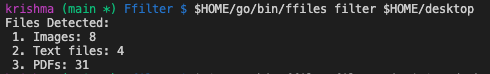
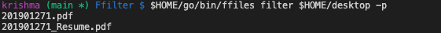
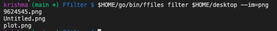

# Ffilter
A CLI application to filter files of different extensions made using Go and Cobra (in progress)

## Description
A CLI tool to filter different extensions. Additional support for organisation and advance filtering of different file types may be added in the future.

## Tech Stack

## Project Screenshots

General usage

Filter PDFs

Filter images based on extensions

